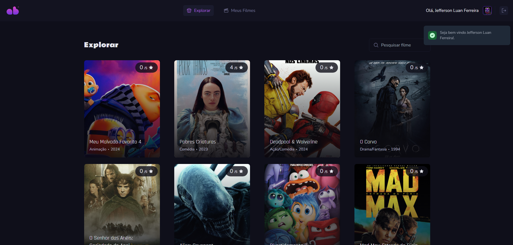

## Projeto Gerenciador de Filmes

Gerenciador de Filmes é uma aplicação desenvolvida em PHP, onde voce salva filmes que assistiu, com a possibilidade de adicionar informações e fazer avaliações.

  

